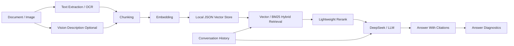

# Multimodal Doc RAG

一个基于大模型的智能文档理解与知识问答系统。项目支持文档上传、图片 OCR、扫描 PDF OCR、可插拔视觉模型描述、RAG 检索、Hybrid Search、轻量重排、DeepSeek 生成答案和引用溯源。

## 功能概览

- 上传 TXT / MD / PDF 文档
- 上传 PNG / JPG / JPEG / BMP / WEBP / TIF / TIFF 图片
- 提取文档文本、页码和来源信息
- 使用 OCR 解析图片和扫描 PDF 页面
- 可选接入 OpenAI-compatible 视觉模型，为图片和图表生成语义描述
- 使用 chunk 切分长文档
- 使用 `BAAI/bge-small-zh-v1.5` 生成 embedding
- 使用轻量本地 JSON 向量库做语义检索
- 支持向量检索和 Hybrid Search，关键词检索部分使用 BM25
- 支持 Query Router 自动选择检索策略
- 支持多轮上下文，将最近问答用于追问消歧和检索增强
- 支持 MMR 多样性召回，减少重复片段挤占上下文窗口
- 支持轻量 rerank，对召回片段进行二次排序
- 支持 DeepSeek API 生成结构化答案
- 展示答案引用来源
- 支持答案诊断，展示可信度、证据覆盖、来源数量和风险提示
- 页面内置示例评测面板
- 支持清空知识库，便于对比不同文档和参数
- 支持查看已索引文档并按文件删除
- 支持问答历史记录和 JSON 导出

## 快速启动

```bash
pip install -r requirements.txt
streamlit run app.py
```

启动后打开：

```text
http://localhost:8501
```

如果暂时没有文档，可以点击侧边栏的 `加载示例文档`，然后提问：

```text
What does RAG do when a user asks a question?
```

## 项目流程



## 使用 DeepSeek API

启动应用后，在侧边栏选择：

```text
LLM Provider: DeepSeek API
DeepSeek 模型名: deepseek-v4-flash
DeepSeek 地址: https://api.deepseek.com
```

然后在 `DeepSeek API Key` 输入框中填入你的 key。Key 只在当前页面会话中使用，不会写入代码或提交到 GitHub。

也可以用环境变量设置：

```powershell
$env:DEEPSEEK_API_KEY="你的 API Key"
streamlit run app.py
```

更多配置说明见 [docs/usage.md](docs/usage.md)。

## OCR 和图片

项目使用 `rapidocr-onnxruntime` 做本地 OCR，支持：

```text
图片 OCR
扫描 PDF 的空文本页面 OCR
```

上传图片或扫描件时，保持侧边栏的 `启用 OCR（图片/扫描 PDF）` 勾选即可。OCR 会把识别出的文字作为文档内容写入向量库，后续可以继续用 RAG 提问。

## 视觉模型描述

DeepSeek API 当前主要用于文本问答。本项目把图片理解做成可插拔的 OpenAI-compatible 视觉接口。

可在侧边栏开启：

```text
启用视觉模型描述（图片/图表）
视觉模型名
视觉模型地址
视觉模型 API Key
```

开启后，上传图片时系统会同时执行 OCR 和视觉模型描述，把图像语义描述也写入知识库。这样不仅能问图片上的文字，还能问图表趋势、画面内容和视觉结论。

## 检索与重排

页面中有两个检索参数：

```text
Top-K: 最终交给模型的片段数量
Fetch-K: 先从向量库召回的候选片段数量
```

检索模式支持：

```text
向量检索: 使用 embedding 相似度召回片段
混合检索: 合并向量相似度和 BM25 关键词检索结果
```

BM25 会考虑词项频率、逆文档频率和文档长度归一化，比单纯关键词重合更适合处理编号、术语、表格字段、OCR 文本等精确匹配场景。

启用 `MMR 多样性召回` 后，系统不会只取分数最高的一串相似片段，而是在相关性和片段差异之间做平衡，避免多个高度重复的 chunk 占满上下文窗口。

开启 `自动选择检索策略` 后，系统会根据问题类型自动选择检索模式和参数：

```text
总结类问题 -> 偏向向量检索
事实/数字/字段类问题 -> 偏向混合检索
图片/图表/表格类问题 -> 偏向混合检索并扩大召回
```

启用轻量重排后，系统会先召回更多片段，再结合向量相似度和关键词重合度做二次排序。当前 rerank 是轻量实现，后续可以替换为 `bge-reranker` 这类专门的重排模型。

## 多轮上下文

页面支持启用多轮上下文。开启后，系统会把最近几轮问答拼接进检索查询，并把最近对话传入 RAG prompt，用来处理追问里的指代关系。

```text
第一轮：RAG 的流程是什么？
第二轮：它的优势是什么？
```

第二轮里的“它”会结合最近对话理解为 RAG，而不是只用孤立问题去检索。多轮上下文只用于理解当前问题，不会被当作新的文档事实。

## 答案诊断

每次问答后，右侧会显示一组诊断指标：

```text
可信度: 综合检索分数、答案与证据重合度、平均分和来源数量
证据覆盖: 答案文本与检索片段之间的词项重合程度
来源数: 当前答案涉及的不同文档来源数量
风险提示: 检索分数过低、证据覆盖不足或来源过于单一时给出提醒
```

这部分不额外调用大模型，主要用于帮助判断答案是否真的被文档支撑。

## 评测

可以在页面的 `评测` 标签页直接运行示例评测，也可以用命令行：

```bash
python scripts/run_eval.py --rerank
```

评测混合检索：

```bash
python scripts/run_eval.py --rerank --retrieval-mode hybrid
```

评测自动策略：

```bash
python scripts/run_eval.py --router
```

评测 MMR 多样性召回：

```bash
python scripts/run_eval.py --router --mmr
```

评测脚本会输出：

- 问题数
- Top-K / Fetch-K
- 是否启用 rerank
- 检索模式
- 是否启用 Query Router
- 是否启用 MMR
- 关键词召回率
- 总耗时
- 每个问题命中的 top source 和相似度

## 项目文档

- [系统架构](docs/architecture.md)
- [使用说明](docs/usage.md)

## 技术栈

- Python
- Streamlit
- PyMuPDF
- RapidOCR
- Sentence Transformers
- Local JSON Vector Store
- BM25
- MMR
- DeepSeek API

## 后续计划

- 接入更强的视觉语言模型，例如 Qwen-VL / MiniCPM-V
- 使用专业 reranker 模型替换轻量重排
- 增加更完整的 RAG 评测集
- 增加 Docker 部署
- 补充页面截图和运行示例
