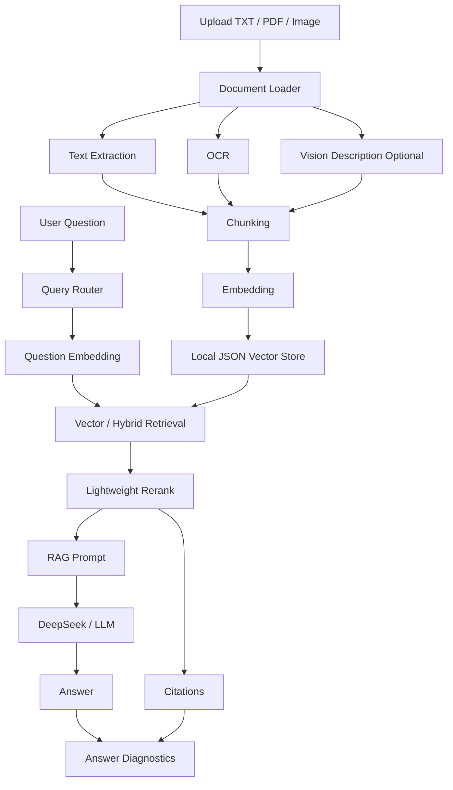

# 系统架构

本文档说明 Multimodal Doc RAG 的核心模块和数据流。

## 模块划分

```text
app.py
页面入口，负责上传、配置、问答、评测和结果展示。

src/document_loader.py
读取 TXT / MD / PDF / 图片，保留文件名、页码和文本内容。

src/ocr.py
使用 RapidOCR 识别图片和扫描 PDF 页面中的文字。

src/vision_client.py
可选调用 OpenAI-compatible 视觉模型，为图片和图表生成语义描述。

src/text_splitter.py
将长文本切分为 chunk，并保留 source、page、chunk_index 等 metadata。

src/embeddings.py
加载 embedding 模型，将文本和问题转换为向量。

src/vector_store.py
封装轻量本地 JSON 向量库，支持向量检索、关键词检索、Hybrid Search、按文件删除和清空知识库。

src/reranker.py
实现轻量重排，结合向量相似度和词项重合度调整候选片段顺序。

src/query_router.py
根据问题类型自动选择检索模式、Top-K、Fetch-K 和是否启用 rerank。

src/rag_chain.py
构造 RAG prompt，并调用 DeepSeek、Ollama 或检索草稿模式生成答案。

src/answer_diagnostics.py
基于检索分数、答案与证据的词项重合度、来源数量和风险规则生成答案可信度诊断。

src/evaluation.py
运行基础检索评测，计算关键词召回率和耗时。
```

## 数据流



## 检索策略

系统目前提供两种检索模式：

```text
Vector Search
使用 embedding 向量相似度召回语义相关片段。

Hybrid Search
合并向量相似度和关键词匹配结果，适合数字、字段名、专有名词和 OCR 文本。
```

检索后可以启用轻量 rerank，对候选片段进行二次排序。

## Query Router

Query Router 会根据问题文本做轻量规则判断：

```text
summary: 总结、概括、主要内容类问题
fact_lookup: 编号、日期、金额、数字、字段类问题
visual_or_table_lookup: 图片、图表、截图、表格类问题
general_qa: 默认问答
```

不同意图会映射到不同的检索策略。例如事实类和图表类问题默认使用 Hybrid Search，总结类问题默认使用 Vector Search。

## 答案生成策略

系统不会直接把用户问题发送给大模型，而是先检索相关片段，再构造包含资料和引用编号的 prompt。

答案要求包含：

```text
结论
依据
引用来源
不确定信息
```

如果资料中没有答案，模型应回答“根据当前文档无法确定”。

## 答案诊断

答案诊断模块不再次调用大模型，而是对已经得到的答案和检索片段做轻量分析：

```text
top_score: 命中文档片段中的最高检索分数
average_score: 命中文档片段的平均检索分数
answer_coverage: 答案句子与证据片段之间的平均词项相似度
source_count: 命中的不同来源文档数量
warnings: 对低分数、低覆盖、来源过于单一等情况给出提示
```

它的作用是让用户看到答案背后的证据质量，降低 RAG 系统“看起来会答，但依据不足”的风险。
